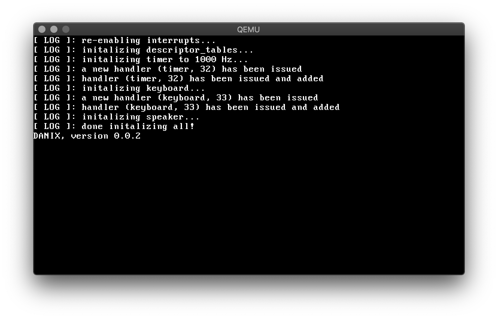
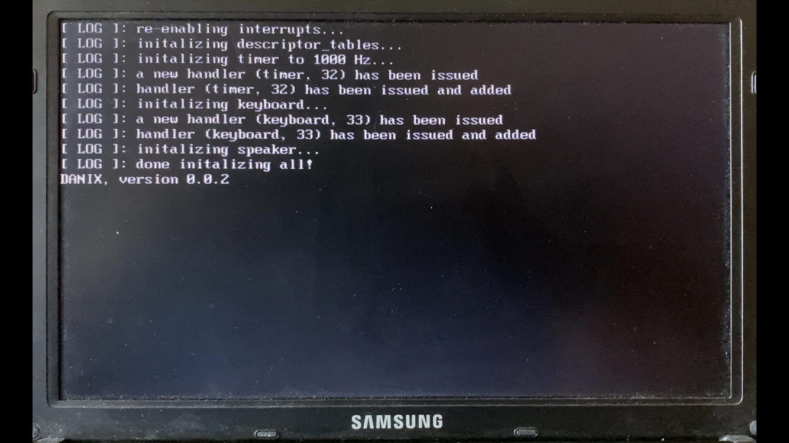

# danix
My personal Operating System

Read `TODO` to see what I have accomplished and need to do.

This is a basic x86 OS and I have no plan for it to go far.

If you wish to contribute, check the `contrib.md` in the `docs` folder.

If you wish to build, check the `build.md` in the `docs` folder.

Tutorials/Code used:
* www.jamesmolloy.co.uk

Screenshots:

